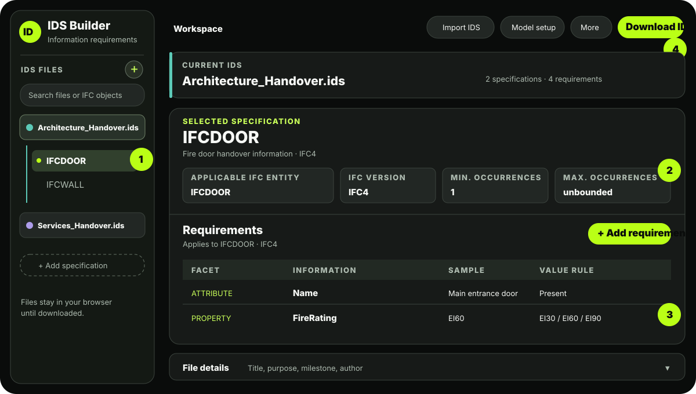
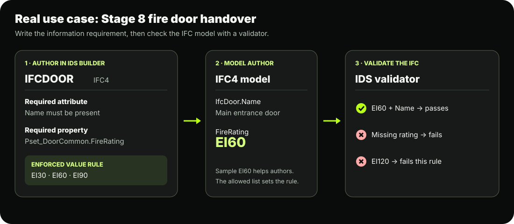

# IDS Builder

Create, edit, and download buildingSMART IDS 1.0 information requirements in your browser. An IDS says **what information an IFC model must contain**. This builder writes the IDS file; a separate IDS validator checks an IFC model against it.

**Use it online:** [Open IDS Builder](https://information-requirements-builder.kristoffer-m-8095.chatgpt.site/). You can also run the files in this repository locally using the steps below.

## Start in three minutes

1. **Open the builder.** In this repository folder, run `python -m http.server 8767`, then open <http://localhost:8767/>. The app is plain HTML, CSS, and JavaScript; it needs no build step. For a longer visual walkthrough, open <http://localhost:8767/guide.html> after starting the server.
2. **Create or import an IDS.** Select the **+** beside **IDS files**, or select **Import IDS files** to open existing `.ids` files. You can import several at once.
3. **Set file details.** Open **File details** below the editor. Enter a title, purpose, milestone, and other delivery information.
4. **Choose an IFC object.** Select **Add specification** in the left panel. Set the **IFC version**, **Applicable IFC entity**, and occurrence limits. The requirements below apply to this selection.
5. **Add requirements.** Select **+ Add requirement**. Choose the facet (such as property or attribute), enter its fields, set its cardinality and value rule, and save. Repeat for each piece of information needed.
6. **Check and save.** Select **Download IDS**. The builder checks for blocking document errors and shows where to fix them. It then downloads the current `.ids` file. Use **More → Download all ZIP** for every open file.

> **Save before closing or refreshing:** Open files and edits are held in browser memory. Download your changed IDS files first.

## What each part does

| Area | Use it for |
| --- | --- |
| **IDS files** (left) | Switch files and their IFC specifications. Each file has a color. Use the search box to find a file or IFC entity. |
| **Current IDS** | Rename the active `.ids` file, choose its color, and see specification and requirement counts. |
| **Selected specification** | Define the IFC version, applicable entity, and minimum/maximum occurrences. |
| **Requirements** | Add, search, edit, or delete the information rules for the selected entity. |
| **File details** | Set title, description, purpose, milestone, date, author, and version. |
| **Model setup** | Add checks IDS can express, such as `IfcProject.Name`; see which setup checks need separate IFC validation. |
| **More** | Preview generated XML, download all files as a ZIP, or clear the workspace. |

## Worked example: fire doors at Stage 8 handover

Imagine the architectural IFC4 handover model must contain fire door information. You want every `IFCDOOR` to have a name and a fire rating from the project's approved set. buildingSMART defines [`Pset_DoorCommon.FireRating` as `IfcLabel` in IFC4](https://standards.buildingsmart.org/IFC/RELEASE/IFC4/FINAL/HTML/schema/ifcsharedbldgelements/pset/pset_doorcommon.htm).

1. Create `Architecture_Handover.ids`. In **File details**, enter a title such as **Architecture Stage 8 handover**, purpose **Stage 8 handover**, and milestone **Stage 8 / Handover**.
2. Select **Add specification** and enter the values below.

   | Field | Enter |
   | --- | --- |
   | Specification name | Fire door handover information |
   | IFC version | `IFC4` |
   | Applicable IFC entity | `IFCDOOR` |
   | Minimum occurrences | `1` if at least one door must exist; otherwise `0` |
   | Maximum occurrences | `unbounded` |

3. Add these two requirements to that specification.

   | Facet | Fields | Cardinality | Value rule | Sample value |
   | --- | --- | --- | --- | --- |
   | Attribute | `Name` | Required | None: the name must be present | Main entrance fire door |
   | Property | `Pset_DoorCommon` → `FireRating`; data type `IFCLABEL` | Required | List: `EI30`, `EI60`, `EI90` (one per line) | `EI60` |

4. Select **Download IDS**. The downloaded file describes the checks another IDS validator should perform on an IFC model. A door with `FireRating = EI60` satisfies the allowed-value rule; a door with no `FireRating`, or a value outside that list, does not.

**Sample value versus value rule:** `EI60` in **Sample value** is guidance for a model author. The **Value rule** is the part enforced by an IDS validator. If you want *any* fire rating rather than only three listed ratings, choose **None** for the value rule and keep the property **Required**.

## Existing IDS files and multiple disciplines

- Use **Import IDS files** to open `.ids` files for architecture, landscape, structure, and services in one workspace. The left panel groups specifications by file.
- To make a new file from selected specifications, choose **Select specifications for extraction**, tick rows across files, then choose **Extract selected**.
- Download one IDS at a time, or use **More → Download all ZIP**. The ZIP contains one `.ids` file per open file.
- Imported advanced XML restrictions are preserved when downloaded. Some advanced restrictions cannot be edited in the form; use **More → Preview XML** to inspect them.

## Before issuing an IDS to a project

The builder checks its document structure and whether exported XML parses. It does **not** prove that an IFC model complies, and it is not a full IDS schema validator. Validate the downloaded IDS with an IDS validator, then run that IDS against the intended IFC model.

The **Model setup** view distinguishes checks expressible in IDS from checks that need a separate IFC review. For example, names can be required through IDS. Coordinate reference system, map conversion, units, and true north need model validation outside this builder.

Illustrative sample values are stored with authoring instructions in each facet's IDS `instructions` attribute because IDS 1.0 has no dedicated sample-value element. They do not automatically become enforced values.

Project-specific IDS examples are not bundled in this public repository. Use the fire-door walkthrough above to learn the controls, then import or create requirements for your own project.
